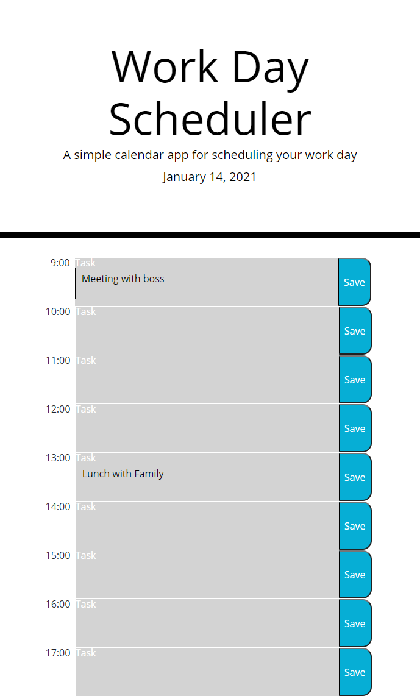

# Calender-task

A link to the deployed webpage is [HERE](https://travis297.github.io/Calendar-task/)

 ## Table of Contents

* [Installation](#installation)
* [Usage](#usage)

## Installation

In order to install this website the files will need to be cloned from the repository.
Once you have the files you can either deploy it via github by pushing it to your own
repository, or have it hosted on a domain.

## Usage

This website can be used in its current state as a day planner, however you would need to clear your cache on a daily basis as there is no functionality for that at the moment. For each hour of the work day you can type in a task or an appointment, press the save button and it will automatically save the data to local storage to be called back when refreshed or reopened. This is a photo of how it should look, however the screenshot was taken late at night so you it assumes the calender is all in the past:

